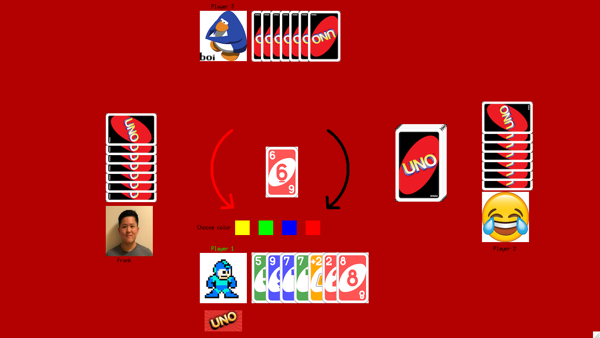

#Uno

## Summary
The following is an implementation of Uno in OCaml as a final project for 3110 by Brian Cheang, Jeffrey Wong, and David Jin

## Installation
It is assumed that the user already has ocaml and opam installed.

Since our game is built using the Graphics module and Camlimages, those will need to be installed
on the player's computer in order for our system to work.

If using the VM, this can be done simply with the following instructions:
The graphics.cma file should already be built into the VM, but it's best to reinstall Graphics and
Camlimages, and then reinstall OCaml as well.  
 
	1. opam install graphics
 
	2. opam install camlimages
 
	3. opam switch reinstall 4.06.0
 
If using a Mac, XQuartz will be needed:  
 
	1. Download XQuartz
 
	2. If you used macports to install OCaml and not homebrew, opam switch reinstall 4.06.0
 
	3. If you used homebrew, brew reinstall ocaml --with-x11
 
 

We have 4 make commands, highlighted in our Makefile.  
 
	1. make clean	: cleans the build files
 
	2. make compile	: like make check in 3110 project files
 
	3. make test 	: tests our test suite and Unit testing
 
	4. make play 	: opens our GUI and plays the game

## Game Rules
Instructions for playing our UNO game:  
	1. Follow standard UNO rules  
	2. Turn 1 is your turn first. You click a valid card to play  
	3. If you cannot play any cards, you must draw a card. You will click the deck to draw a new card.  
	4. Whenever you play a Wild or Wild4 card, you also have the option to choose a new color. The
	   4 colored boxes allow you to select which color you want. You new change is reflected by the color
	   of the arrows.  
	5. When you have UNO, you must press the UNO button or you will be punished. The UNO button will play
	   any valid card left in your hand.  
	6. Good luck!  
